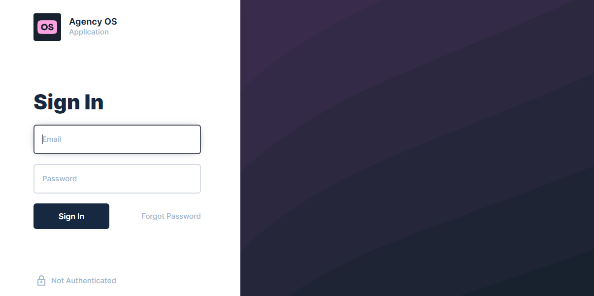

# Agency OS docker compose demo CI/CD pipeline

Example CI/CD pipeline showing how to deploy a direct instance to elestio.

 
 

# Once deployed ...

You can connect to the Agency OS Dashboard:

    Access URL: https://[CI_CD_DOMAIN]/
    Login: [ADMIN_EMAIL]
    Password: [ADMIN_PASSWORD]

# First use

To install Agency OS you'll have to connect to SSH, (click on `Open terminal` button on the top right of the screen), and enter this:

        expect ./scripts/expect.sh

# Note

By default, it is preloaded with version 9.26.0, and subsequent versions will be accompanied by a BSL license. For additional information on the Directus BSL license, you can check <a href="https://directus.io/bsl">here.</a>
